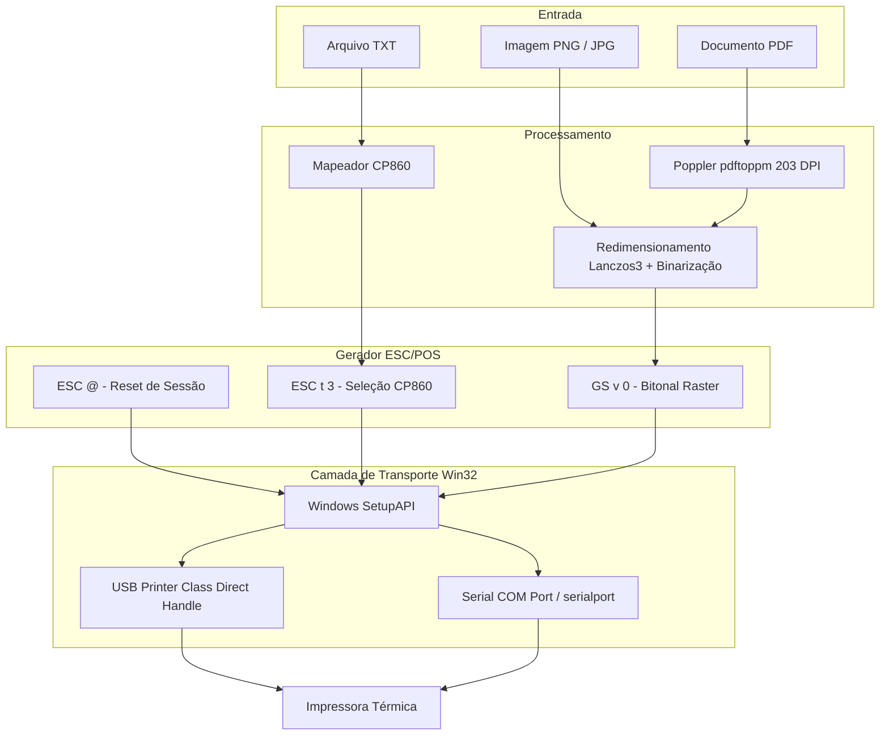

# Documentação Técnica — THZ ThermalKit

O **THZ ThermalKit** é uma suíte de ferramentas de baixo nível para Windows desenvolvida em **Rust**, projetada para comunicação, diagnóstico e impressão direta em impressoras térmicas genéricas padrão **ESC/POS** (como modelos 58mm / POS-58, TECH CLA58, MPT-II, etc.) sem intermediação de drivers proprietários ou do spooler do Windows.

---

## 1. Visão Geral e Filosofia

Tradicionalmente, impressoras térmicas no Windows sofrem com:
- Drivers proprietários ("POS-58 driver") instáveis ou obsoletos.
- Spooler do Windows que redimensiona ou rasteriza de forma inadequada documentos para 58mm.
- Dificuldades de acentuação em português (tabelas de caracteres desconfiguradas).

O **THZ ThermalKit** adota uma abordagem *driverless / direct transport*:
1. **Comunicação Direta de Hardware**: Acessa a impressora diretamente através da interface USB de classe de impressão (`usbprint.sys`) ou de portas seriais (`COM`), sem criar filas de impressão do sistema operacional.
2. **Controle Estrito de Comandos**: Envia sequências puras de bytes ESC/POS. Não envia comandos destrutivos (corte de guilhotina ou abertura de gaveta) sem necessidade.
3. **Perfis Persistentes em JSON**: Armazena as propriedades físicas (largura em pontos, codificação de caracteres, baud rate, VID/PID) separadamente da lógica de execução.
4. **Segurança por Confirmação**: Todas as ações de impressão física requerem confirmação explícita do operador.

---

## 2. Estrutura do Projeto

```
thermal-probe/
├── Cargo.toml                  # Configuração de dependências e múltiplos binários
├── profiles/
│   └── tech-cla58.json         # Perfil validado para impressora TECH CLA58
├── src/
│   ├── next.rs                 # CLI 'thermal-probe' com subcomandos de diagnóstico e impressão
│   ├── desktop.rs              # App GUI 'thz-thermalkit' em egui/eframe com prévia visual
│   └── main.rs                 # Protótipo inicial do CLI de sondagem e teste
└── assets/                     # Recursos visuais (screenshots da interface)
```

### Configuração de Binários (`Cargo.toml`)
- **`thermal-probe`** (`src/next.rs`): Interface de linha de comando completa.
- **`thz-thermalkit`** (`src/desktop.rs`): Interface gráfica desktop nativa com prévia em tempo real.

---

## 3. Arquitetura do Sistema



---

## 4. Camadas e Componentes Técnicos

### 4.1. Camada Win32 SetupAPI (`USBPRINT` e `COM`)
A enumeração dos dispositivos utiliza funções nativas da biblioteca `setupapi.dll`:
- **`SetupDiGetClassDevsW`**: Enumera dispositivos de classe presentes no sistema.
- **GUIDs Monitorados**:
  - `USBPRINT`: `{28D78FAD-5A12-11D1-AE5B-00F803A8C2}` — Impressoras conectadas via USB.
  - `COMPORT`: `{86E0D1E0-8089-11D0-9CE4-083E301F73}` — Portas seriais virtuais ou físicas (incluindo Bluetooth SPP).
  - `USB_DEVICE`: `{A5DCBF10-6530-11D2-901F-00C04FB951ED}` — Inventário de hardware geral.
- **Identificação USB**: Extrai strings de propriedades (`FRIENDLY_NAME`, `HARDWARE_ID`) para identificar `VID` (Vendor ID) e `PID` (Product ID).
- **Identificação Bluetooth SPP**: Inspeciona a propriedade `HARDWARE_ID` e o `DeviceInstanceId`. Se contiver o enumerador `BTHENUM` ou o UUID padrão do Serial Port Profile (`00001101-0000-1000-8000-00805F9B34FB`), o dispositivo é identificado e classificado como **Bluetooth (COM)**.
- **Acesso Direto ao Hardware**:
  - Em conexões USB: abre diretamente o caminho de dispositivo Win32 via `OpenOptions::new().write(true).open(&device.path)`.
  - Em conexões Bluetooth / COM: abre o stream de porta serial via `serialport` no baud rate especificado (padrão: 9600) com timeout de escrita e flush síncrono.
  - Ambas as abordagens eliminam completamente a necessidade de criação de filas de impressão no Windows ou instalação de drivers POS-58.

### 4.2. Tratamento de Codificação e Caracteres (Português / CP860)
Impressoras ESC/POS genéricas normalmente não suportam UTF-8 nativamente.
- O projeto envia o comando `ESC t 3` (`0x1b, 0x74, 0x03`) para selecionar a tabela de caracteres **Code Page 860 (Português)**.
- O módulo de conversão mapeia dinamicamente caracteres acentuados do português (`á`, `é`, `í`, `ó`, `ú`, `ã`, `õ`, `ç`, `Á`, `É`, etc.) para os seus respectivos códigos hexadecimais na CP860. Caracteres sem suporte direto são substituídos por `?`.

### 4.3. Pipeline de Imagens e Raster (`GS v 0`)
Para imagens monocromáticas e gráficos:
- **Redimensionamento**: Ajusta a largura para o tamanho útil definido no perfil (padrão: 384 dots para bobinas de 58 mm) mantendo o aspect ratio via filtro `Lanczos3`.
- **Limiarização (Thresholding)**: Converte tons de cinza em preto e branco puro (`pixel < 180 => 1` / preto impresso).
- **Comando Raster**: Empacota os bits na estrutura ESC/POS `GS v 0 0 xL xH yL yH [dados...]`:
  - `xL, xH`: Largura em bytes por linha (`width.div_ceil(8)`).
  - `yL, yH`: Altura em pixels.

### 4.4. Renderização de PDFs
- Para manter o binário Rust enxuto e evitar dependências pesadas de C++ em tempo de compilação, o sistema invoca o executável externo **`pdftoppm`** (do pacote Poppler).
- O PDF é renderizado página a página a **203 DPI** (resolução padrão de cabeçotes térmicos de 8 dots/mm) em formato PNG temporário.
- As imagens geradas são então processadas e transmitidas via raster `GS v 0`.

---

## 5. Perfis de Impressora (`profiles/*.json`)

Os perfis desacoplam o hardware das instruções de impressão. Exemplo (`profiles/tech-cla58.json`):

```json
{
  "id": "generic-tech-cla58-raster",
  "name": "TECH CLA58",
  "transport": {
    "type": "usb-printer-class",
    "vid": "6868",
    "pid": "0200",
    "port": null
  },
  "protocol": "escpos",
  "raster_mode": "gs-v-0",
  "printable_width_dots": 384,
  "baud": 9600,
  "code_page": 3
}
```

---

## 6. Guia de Uso

### 6.1. Aplicativo Gráfico Desktop (`thz-thermalkit`)
Interface gráfica com modo escuro, detecção de status de conexão, carregamento de perfis e prévia visual:

```powershell
cargo run --bin thz-thermalkit
```

### 6.2. Linha de Comando (`thermal-probe`)

| Comando | Descrição |
| --- | --- |
| `cargo run -- discover` | Lista todas as interfaces USB e COM detectadas |
| `cargo run -- probe [--device N] [--baud 9600]` | Envia teste básico (texto ASCII + quadrado 16x16) |
| `cargo run -- width-test [--device N] [--width 384]` | Imprime régua milimetrada graduada para calibrar largura |
| `cargo run -- charset-test [--device N]` | Testa impressão de acentuação na CP860 |
| `cargo run -- profile create --device N [opções]` | Cria um novo perfil JSON com base no dispositivo |
| `cargo run -- print-text --profile <path> <file.txt>` | Imprime arquivo de texto formatado com CP860 |
| `cargo run -- print-image --profile <path> <file.png>` | Imprime imagem ajustada para a largura em dots |
| `cargo run -- print-pdf --profile <path> <file.pdf>` | Renderiza e imprime páginas de PDF a 203 DPI |

---

## 7. Pré-requisitos de Ambiente

1. **Sistema Operacional**: Windows 10 ou 11 (arquitetura x64).
2. **Toolchain Rust**: Rust 2021 edition (MSVC toolchain recomendada).
3. **Poppler for Windows** (necessário apenas para impressão de arquivos PDF):
   ```powershell
   winget install --exact --id oschwartz10612.Poppler
   ```
