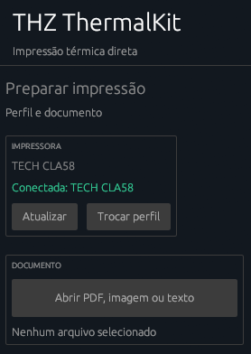

# THZ ThermalKit

Ferramentas Windows para impressoras térmicas ESC/POS genéricas: descoberta USB, perfil persistente e impressão direta de texto, imagem e PDF sem depender do driver POS-58.



## Validado em hardware

| Item | Resultado |
| --- | --- |
| Impressora | TECH CLA58 / MPT-II |
| Transporte | USB Printer Class direto |
| Identidade USB | VID `6868`, PID `0200` |
| Linguagem | ESC/POS |
| Largura útil | 384 dots / 58 mm |
| Raster | GS v 0 |
| Texto em português | CP860 com `ESC t 3` |

## THZ ThermalKit Desktop

O aplicativo desktop abre TXT, PNG, JPG e PDF, mostra uma prévia em 58 mm e pede confirmação dentro da janela antes de imprimir. A impressão é enviada diretamente para a interface USB da impressora.

```powershell
cargo run --bin thz-thermalkit
```

Para PDF, instale o Poppler e confirme que `pdftoppm -v` funciona no terminal:

```powershell
winget install --exact --id oschwartz10612.Poppler
```

## thermal-probe CLI

Small Windows CLI to discover attached USB Printer Class and serial COM interfaces and send a minimal ESC/POS print test. It accesses the USB printer device interface directly through Windows `usbprint.sys`, or opens a COM port directly. No POS-58 print queue or vendor print driver is required for these paths.

## Build and run

Install the Rust toolchain for Windows, then run:

```powershell
cargo run --release
```

The program lists connected USB devices, USB Printer Class interfaces, and COM interfaces with their device instance, hardware IDs, VID/PID when available, interface path, and COM port. Generic USB device entries are inventory only and cannot be printed to. Choose a print-capable interface, verify the selected device, and type `PRINT` to send the physical test. Enter or any other response exits without sending data. For USB-to-serial or Bluetooth serial, use `--baud 9600` (or the rate configured for your printer).

The test contains ESC @, ASCII text, line feeds, and a 16×16 pixel GS v 0 raster square. It does not send cut, cash drawer, reset-to-factory, or configuration commands. ESC @ initializes the printer's current session.

## Scope and limitations

USB devices, USB Printer Class devices, and COM interfaces are enumerated through Windows SetupAPI. USB serial and Bluetooth serial devices that expose COM interfaces can be selected. A vendor-specific USB interface without `usbprint.sys` or a COM port appears in inventory only and needs a future transport implementation. Some USB printers require Windows USB Printing Support; that class driver is distinct from the POS-58 print driver. COM settings default to 9600 baud, 8 data bits, no parity, one stop bit, and no flow control.

The transport and device metadata are kept separate from the test payload so later milestones can add printer profiles, alternate COM settings, and richer Bluetooth discovery. The program does not claim to identify a particular physical POS-58 from its USB IDs alone; confirm the listed device before printing.

## Milestone 1 commands

The CLI now keeps printer configuration in an explicit JSON profile and sends text and raster output through the matching direct device interface.

```powershell
# List available interfaces only; sends no data.
cargo run -- discover

# Print a 384-dot ruler. Confirm the print by typing PRINT.
cargo run -- width-test --device 1 --width 384

# Identify the ESC/POS code page that prints Portuguese accents correctly.
cargo run -- charset-test --device 1

# Save the confirmed USB device as a reusable profile. This sends no data.
cargo run -- profile create --device 1 --width 384 --code-page 3 --output profiles/tech-cla58.json

# Print a UTF-8 text file (ASCII is the reliable baseline for generic ESC/POS).
cargo run -- print-text --profile profiles/tech-cla58.json receipt.txt

# Resize a PNG or JPEG to the profile width, convert it to monochrome raster, and print it.
cargo run -- print-image --profile profiles/tech-cla58.json image.png

# Render each PDF page at 203 DPI and print it at the profile width.
cargo run -- print-pdf --profile profiles/tech-cla58.json document.pdf
```

`print-pdf` needs `pdftoppm` from Poppler for Windows available in `PATH`; this keeps the Rust binary small while using a mature local PDF renderer. PDF rendering itself does not send print data. The CLI identifies the printer again from the profile and requires `PRINT` once before any complete print job is sent.

Generic ESC/POS printers rarely accept UTF-8 directly. The confirmed TECH CLA58 / MPT-II profile uses CP860, selected with `ESC t 3`. `print-text` converts the common Portuguese accented characters to CP860 bytes before sending them.
